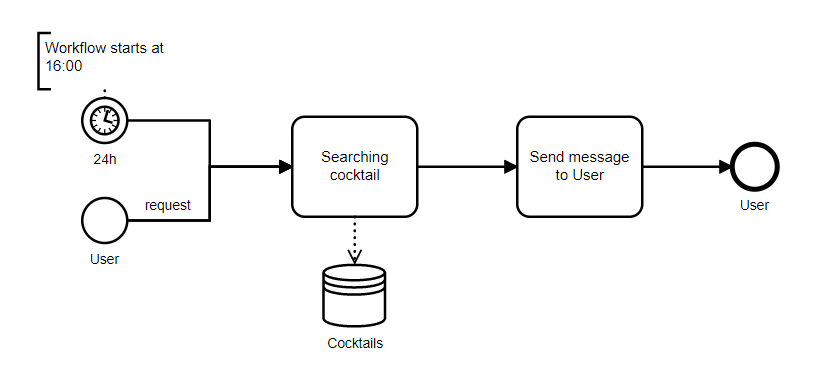

# Cocktail-TelegramBot


## Idea
The main idea is to create real application, which can be used by someone else. 

## How it works 
- User can send a request to find cocktails by name or by ingredients.
- User can subscribe to the newsletter

## Find cocktails workflow
The workflow of finding cocktails by schedule and by user:


## Deployment
Required software:
- terminal for running bash scripts
- docker-compose 
- maven
- mysql

For deploying application you need to add BotName, BotToken in application.properties and run bash script:
```shell
bash start.sh
```

Also change mysql default port to 3307 because app works on 3306
## DataBase of Cocktails
to fill cocktail information you need run [DataBaseOfCocktails](https://github.com/Stepan-eagle/DataBaseOfCocktails)

## Local development

For local development and testing:
- Add BotName and BotToken in application-test.properties
- Use `docker-compose-test.yml`
- Run command:
```shell
docker-compose -f docker-compose-test.yml up
```

- Add VM Options: `-Dspring.profiles.active=test `

With these configurations - run SpringBoot main method.

# Technological stack
- SpringBoot as a skeleton framework
- Spring Scheduler as a task manager
- MySQL database as a database for saving cocktails, user and subscription info
- Flyway database migration tool
- Telegram-bot SpringBoot starter
- Spring Data starter